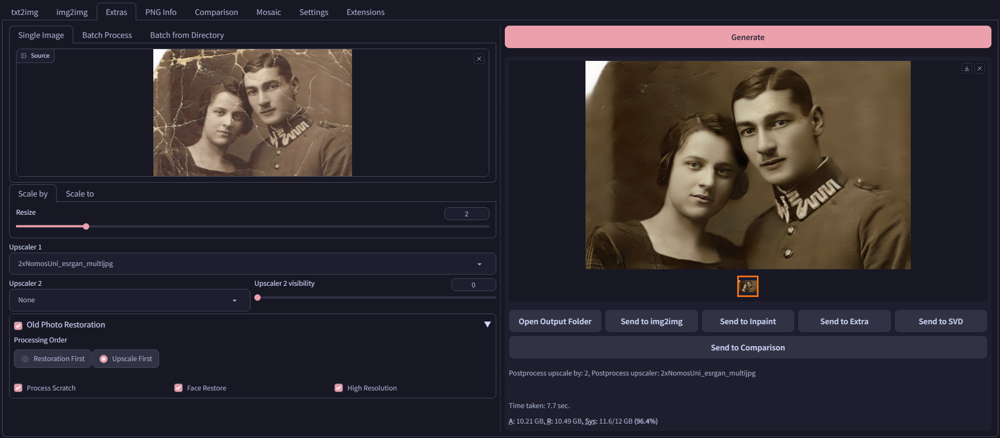

# SD Webui Old Photo Restoration
This is an Extension for the [Automatic1111 Webui](https://github.com/AUTOMATIC1111/stable-diffusion-webui), which allows you to perform **Bringing-Old-Photos-Back-to-Life** natively.

> Compatible with [Forge](https://github.com/lllyasviel/stable-diffusion-webui-forge)

> Original Paper: https://arxiv.org/abs/2004.09484

> Original Repo: https://github.com/microsoft/Bringing-Old-Photos-Back-to-Life *(includes some example images)*

## Requirements
0. Install this Extension
1. Download `global_checkpoints.zip` from [Releases](https://github.com/Haoming02/sd-webui-old-photo-restoration/releases)
2. Extract and put the `checkpoints` **folder** *(not just the files)* into `~webui/extensions/sd-webui-old-photo-restoration/lib_bopb2l/Global`
3. Download `face_checkpoints.zip` from [Releases](https://github.com/Haoming02/sd-webui-old-photo-restoration/releases)
4. Extract and put the `checkpoints` **folder** *(not just the files)* into `~webui/extensions/sd-webui-old-photo-restoration/lib_bopb2l/Face_Enhancement`
5. Download `shape_predictor_68_face_landmarks.zip` from [Releases](https://github.com/Haoming02/sd-webui-old-photo-restoration/releases)
6. Extract the `.dat` **file** into `~webui/extensions/sd-webui-old-photo-restoration/lib_bopb2l/Face_Detection`

> The [Releases](https://github.com/Haoming02/sd-webui-old-photo-restoration/releases) page includes the original links, as well as the backups mirrored by myself

> Another mirror: [Google Drive](https://drive.google.com/drive/folders/1CXAgAYQzz_JkMmxqcabvgGhG_msyMkyS)

## How to Use
After installing this Extension, there will be an **Old Photo Restoration** section in the **Extras** tab

0. Expand the dropdown to enable the features
1. Upload the image(s) to be processed
2. Adjust the settings as needed
3. Click **Generate**
4. The result(s) will show up on the right once the process finishes

## Settings
- **Processing Order:** Choose between upscaling the image first or perform the restoration first
- **Process Scratch:** Remove scratches from the image
- **Face Restore:** Use a pre-trained model to improve the faces
  - *(This is **different** from the Webui built-in ones)*
- **High Resolution:** Use higher parameters to do the processing
  - *(Only has an effect when either `Process Scratch` or `Face Restore` is also enabled)*
- **Use CPU:** Enable this if you do not have a Nvidia GPU or are getting **Out of Memory** Error
