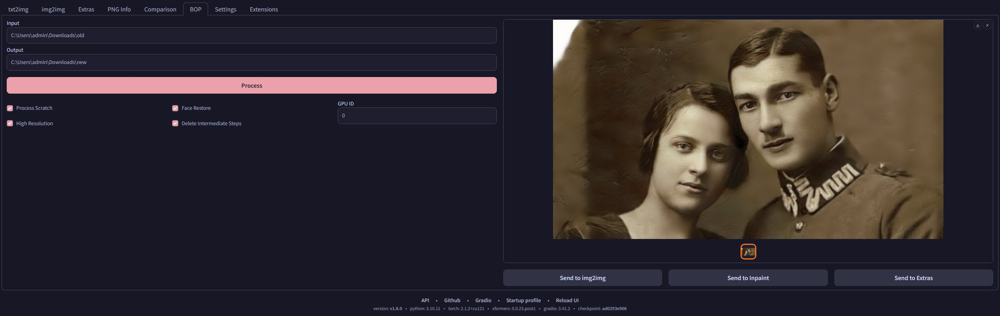

# SD Webui Old Photo Restoration
This is an Extension for the [Automatic1111 Webui](https://github.com/AUTOMATIC1111/stable-diffusion-webui), which allows you to perform **Bringing-Old-Photos-Back-to-Life** from the webui, 
and then send the output into `img2img` or `Inpaint` for further touch-up.

> Original Paper: https://arxiv.org/abs/2004.09484

> Original Repo: https://github.com/microsoft/Bringing-Old-Photos-Back-to-Life

## How to Use
After installing this Extension, there will be a new **`BOP`** tab on top. 
Enter the **absolute path** to a folder containing the input images, then click **Process** to start.
- The path needs to be an **absolute path** that directly points to the folder, and the path should contain **no spaces**
- The outputs are saved to `~webui\outputs\old-photo-restoration` (by default)
- The [original repo](https://github.com/microsoft/Bringing-Old-Photos-Back-to-Life) included some sample images

## Settings
- **Process Scratch:** Fix and remove the scratches from the images
- **Face Restore:** Use the pre-trained model to improve the faces
  - *(This is **not** the same as the built-in ones on the Webui)*
- **High Resolution:** Use higher parameters to do the processing
  - *(Only has an effect when either `Process Scratch` or `Face Restore` is also active)*
- **Delete Intermediate Steps:** Only keep the final results
- **GPU ID:** Specify the GPU to use. Set to `-1` to use CPU instead.

## Requirements
> The Python packages should be installed automatically on the first launch

#### Install
0. Clone this repo into the `~webui/extensions` folder
1. Download `global_checkpoints.zip` from [Releases](https://github.com/Haoming02/sd-webui-old-photo-restoration/releases)
2. Extract and put the `checkpoints` **folder** *(not just the files)* into `~webui/extensions/sd-webui-old-photo-restoration/Global`
3. Download `face_checkpoints.zip` from [Releases](https://github.com/Haoming02/sd-webui-old-photo-restoration/releases)
4. Extract and put the `checkpoints` **folder** *(not just the files)* into `~webui/extensions/sd-webui-old-photo-restoration/Face_Enhancement`
5. Download `shape_predictor_68_face_landmarks.zip` from [Releases](https://github.com/Haoming02/sd-webui-old-photo-restoration/releases)
6. Extract the `.dat` **file** into `~webui/extensions/sd-webui-old-photo-restoration/Face_Detection`

> The [Releases](https://github.com/Haoming02/sd-webui-old-photo-restoration/releases) page contains the original links, as well as the backup links hosted by myself. 
Downloading from either one is fine.

> The 3. ~ 6. are optional if you don't wish to use **Face Restore**

#### Uninstall
Delete the following folders:
- `~webui\extensions\sd-webui-old-photo-restoration`
- `~webui\outputs\old-photo-restoration`

## Note
- If you installed the old version before, you can safely delete the following folders:
    - `~webui\repositories\BOP-BtL`
    - `~webui\repositories\Synchronized-BatchNorm-PyTorch`
- The repeated requirements installation is fixed in Webui `v1.7.0`
